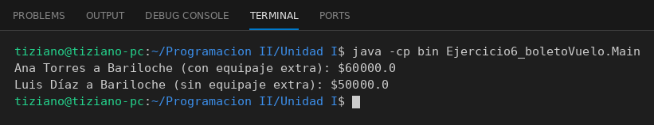

# BoletoVuelo

Programación II - Unidad 1 - Ejercicio 6

## Consigna
Representar un pasaje aéreo low-cost y calcular su precio final según si lleva equipaje extra.

## Lógica
- **Atributos (privados):** `pasajero`, `destino` (String), `tarifaBase` (double) y `llevaEquipajeExtra` (boolean).
- **Constructor:** inicializa los cuatro datos del vuelo.
- **`calcularPrecioFinal()`:** si `llevaEquipajeExtra` es `true` retorna `tarifaBase * 1.20` (20% adicional); si no, retorna la tarifa base.
- **`Main`:** crea dos boletos con la misma tarifa (uno con equipaje extra y otro sin) y muestra los precios para compararlos ($60000 vs $50000).

## Ejecución

